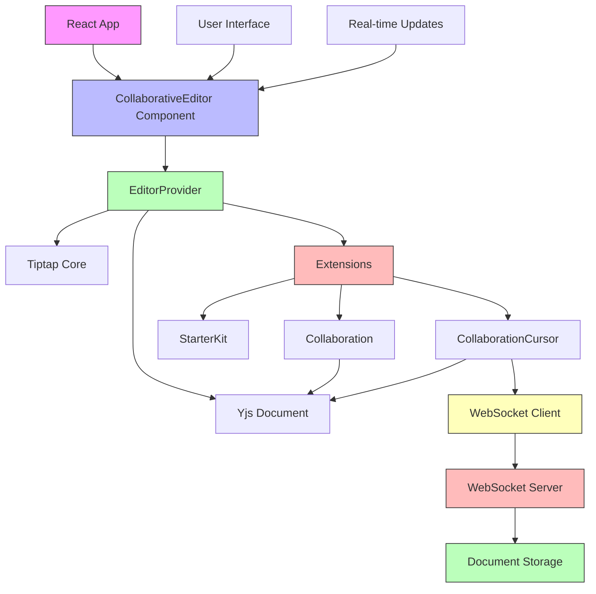

# Architecture Diagram

## Component Relationships

1. **React App** renders the **CollaborativeEditor Component**
2. **CollaborativeEditor** uses **EditorProvider** to create the editor instance
3. **EditorProvider** integrates:
   - **Tiptap Core** for editor functionality
   - **Yjs Document** for collaborative state management
   - **Extensions** for additional features
4. **Extensions** include:
   - Core Tiptap extensions (StarterKit, Collaboration, etc.)
5. **Collaboration extensions** connect to:
   - **Yjs Document** for shared state
   - **WebSocket Client** for real-time communication
6. **WebSocket Client** connects to **WebSocket Server**
7. **WebSocket Server** manages:
   - **Document Storage** for persistent document state
8. **User Interface** and **Real-time Updates** interact with the editor

## Data Flow

1. User interacts with the editor through the UI
2. Commands are processed by Tiptap Core
3. Changes are applied to the Yjs Document
4. Yjs synchronizes changes with other clients via WebSocket
5. **WebSocket Client** sends updates to **WebSocket Server**
6. **WebSocket Server** broadcasts updates to all connected clients
7. **WebSocket Client** receives remote changes
8. Yjs applies remote changes to the document
9. Tiptap Core updates the editor view
10. UI reflects the updated state

## Recent Updates

1. **Simplified Extension System**: Removed the custom ExtensionManager to resolve runtime errors
2. **Direct Extension Usage**: Using Tiptap extensions directly instead of through a manager
3. **WebSocket Server**: Simplified implementation that works with available dependencies
4. **Document Storage**: In-memory storage for documents (can be extended with databases)

## Deployment Considerations

For production deployment:

1. **WebSocket Server**:
   - Use a robust WebSocket server implementation
   - Implement proper error handling and logging
   - Add authentication and authorization
   - Use a database for document persistence

2. **Client-Side**:
   - Implement reconnection logic
   - Add error handling for network issues
   - Optimize performance for large documents

3. **Security**:
   - Validate all incoming data
   - Implement rate limiting
   - Add encryption for sensitive data