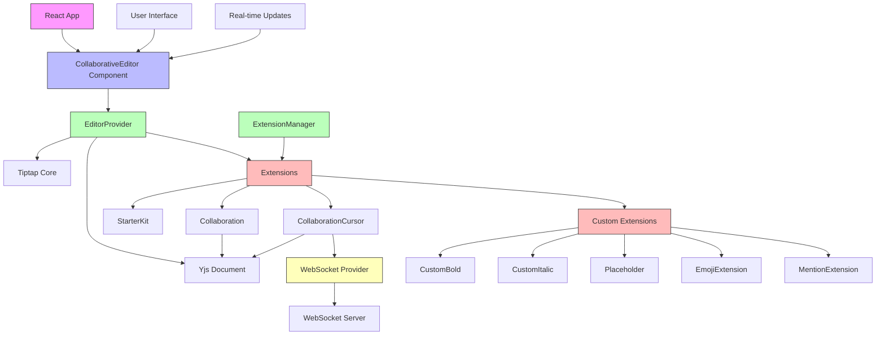

# Architecture Diagram

## Component Relationships

1. **React App** renders the **CollaborativeEditor Component**
2. **CollaborativeEditor** uses **EditorProvider** to create the editor instance
3. **EditorProvider** integrates:
   - **Tiptap Core** for editor functionality
   - **Yjs Document** for collaborative state management
   - **Extensions** for additional features
4. **Extensions** include:
   - Core Tiptap extensions (StarterKit, Collaboration, etc.)
   - Custom extensions (CustomBold, CustomItalic, etc.)
5. **Collaboration extensions** connect to:
   - **Yjs Document** for shared state
   - **WebSocket Provider** for real-time communication
6. **WebSocket Provider** connects to **WebSocket Server**
7. **ExtensionManager** manages all extensions
8. **User Interface** and **Real-time Updates** interact with the editor

## Data Flow

1. User interacts with the editor through the UI
2. Commands are processed by Tiptap Core
3. Changes are applied to the Yjs Document
4. Yjs synchronizes changes with other clients via WebSocket
5. Remote changes are received through WebSocket Provider
6. Yjs applies remote changes to the document
7. Tiptap Core updates the editor view
8. UI reflects the updated state